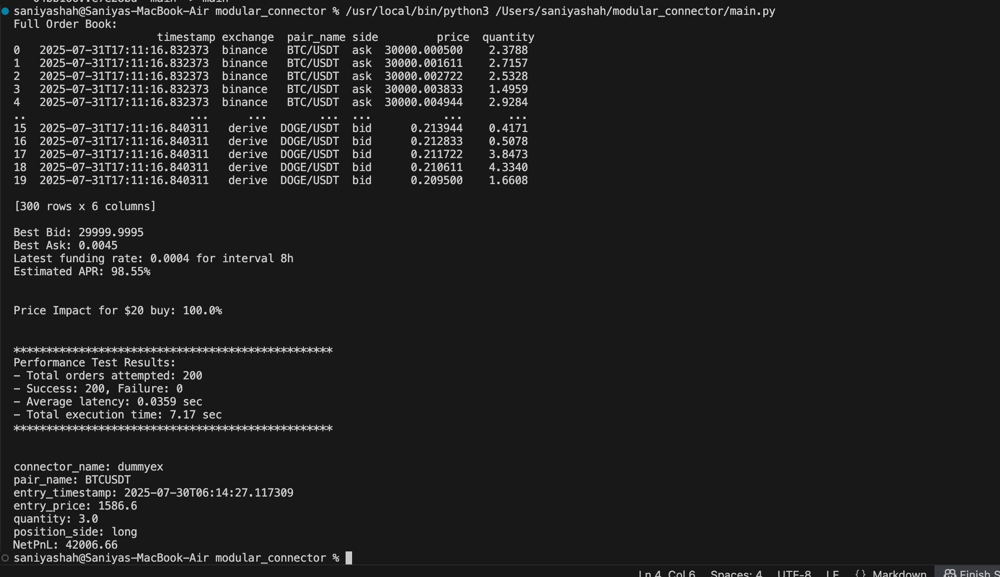

1) I have created a dummy infrastructure that generates crypto currency prices using a random function and performs functionalities as mentioned in the "Work Trail Crpto" pdf. 
2) For tasks 1,2 and 3, run main.py file and the output would look like 

